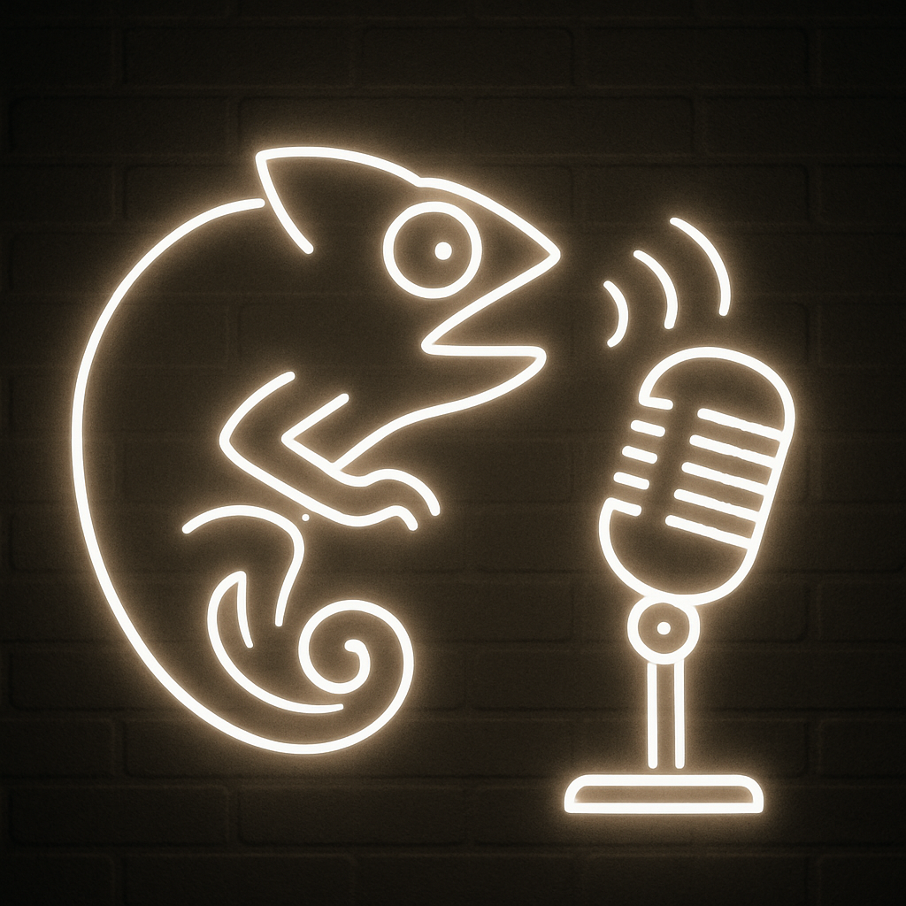

<h1>
  Xpress‑VC: Expressive Voice Conversion With Joint Timbre and Prosody Transfer
</h1>

> [!IMPORTANT] 
> This is a university project, which was done using kaggle free resources, so keep your expectations accordingly!

